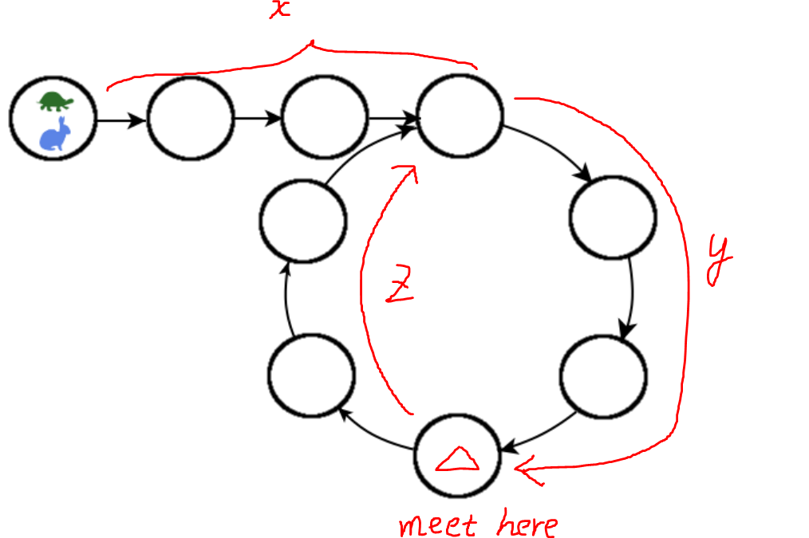

# Linked List Cycle II





## Solution 1 \(Go\)

```go
/**
 * Definition for singly-linked list.
 * type ListNode struct {
 *     Val int
 *     Next *ListNode
 * }
 */
func detectCycle(head *ListNode) *ListNode {
    m := make(map[*ListNode]bool)
    for head != nil {
        if _,found := m[head]; found {
            return head
        }
        m[head] = true
        head = head.Next
    }
    return nil
}
```

## Solution 2 \(Go\)

```go
/**
 * Definition for singly-linked list.
 * type ListNode struct {
 *     Val int
 *     Next *ListNode
 * }
 */
func detectCycle(head *ListNode) *ListNode {
    hasCycle, tortoise := hasCycle(head)
    if head == nil || head.Next == nil || !hasCycle {
        return nil
    }
    hare := head
    // both move by 1 and look for second meet
    for tortoise != hare {
        tortoise = tortoise.Next
        hare = hare.Next
    }
    return tortoise
}

// from ID: 141
func hasCycle(head *ListNode) (bool, *ListNode) {
    tortoise, hare := head, head
    for tortoise != nil && hare != nil && hare.Next != nil {
        tortoise = tortoise.Next
        hare = hare.Next.Next
        if tortoise == hare {
            return true, tortoise
        }
    }
    return false, nil
    
}
```

## Solution 3 \(Java\)

```java
/**
 * Definition for ListNode
 * public class ListNode {
 *     int val;
 *     ListNode next;
 *     ListNode(int x) {
 *         val = x;
 *         next = null;
 *     }
 * }
 */

public class Solution {
    /**
     * @param head: The first node of linked list.
     * @return: The node where the cycle begins. if there is no cycle, return null
     */
    public ListNode detectCycle(ListNode head) {
        if (head == null || head.next == null)
            return null;

        ListNode slow = head;
        ListNode fast = head.next;
        
        // slow and fast meet for the first time
        while (slow != fast) {
            if (fast == null || fast.next == null)
                return null;
            slow = slow.next;
            fast = fast.next.next;
        }

        // the second meeting point is the start of the cycle
        fast = fast.next;
        while (head != fast) {
            head = head.next;
            fast = fast.next;
        }
        return head;
    }

}
```



We first use the same algorithm \(modified to return the first meeting point\) for [problem ID: 141](linked-list-cycle.md#solution-2). If there is no cycle, we are done and return null. If there is a cycle, we store the first meeting point. From this first meeting point, we set the speed of both the tortoise and the hare to moving by 1 each time. Eventually, they will meet again at the start of the cycle. A quick proof is as follows:

Let `x` be the distance between the `head` and the start of the cycle, `y` be the distance between the start of the cycle to the first meeting point, `z` be the distance between the first meeting point to the start of the cycle. It is clear that `x + y = n`, where `n` is the length of the cycle. Consider the following equations for their first meet:

$$
t_{tortoise} = \frac{x+y}{1}, \hspace{0.2cm} t_{hare} = \frac{x+y+z+y}{2}
$$

Because they meet at the first meeting point, their time spent traveling should be the same. Setting the two t's equal to each other, we have `x = z`.

Using this result, we have either one of them start at the `head` of the list and the other continue at their first meeting point \(with the same speed now\). They will eventually meet at the start of the cycle thanks to the fact `x = z`.

