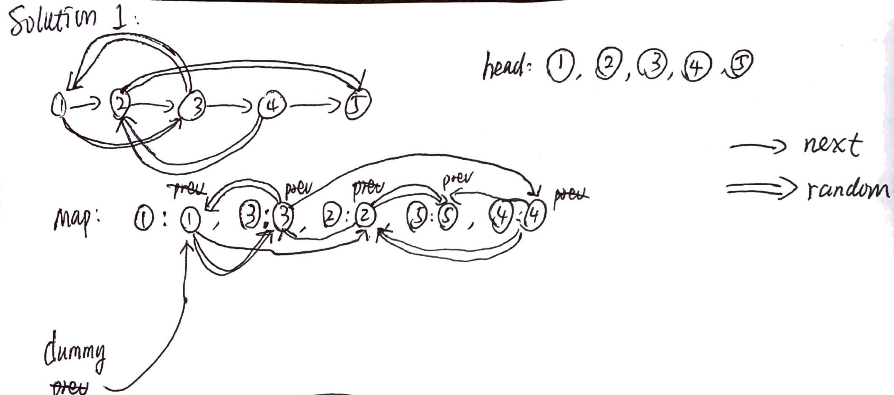
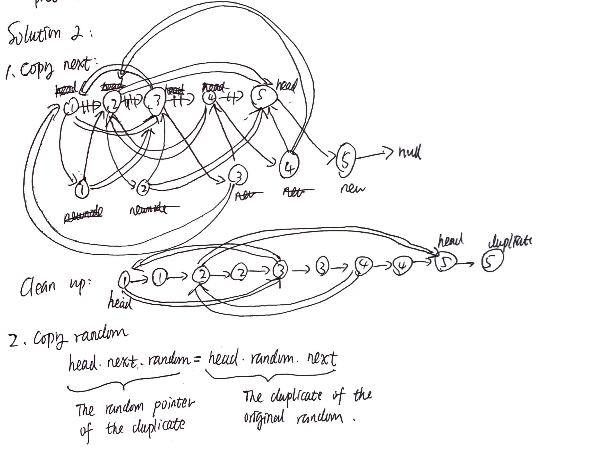

# Copy List with Random Pointer



## Solution 1 \(Java\)

```java
/**
 * Definition for singly-linked list with a random pointer.
 * class RandomListNode {
 *     int label;
 *     RandomListNode next, random;
 *     RandomListNode(int x) { this.label = x; }
 * };
 */
public class Solution {
    /**
     * @param head: The head of linked list with a random pointer.
     * @return: A new head of a deep copy of the list.
     */
    public RandomListNode copyRandomList(RandomListNode head) {
        if (head == null) return null;

        RandomListNode dummy = new RandomListNode(0);
        RandomListNode prev = dummy, newNode;
        HashMap<RandomListNode, RandomListNode> map = new HashMap<RandomListNode, RandomListNode>();

        while (head != null) {
            // deal with the core nodes
            if (!map.containsKey(head)) {
                newNode = new RandomListNode(head.label);
                map.put(head, newNode);
            } else {
                newNode = map.get(head);
            }
            prev.next = newNode;

            // deal with random pointers of the core nodes
            if (head.random != null) {
                if (!map.containsKey(head.random)) {
                    newNode.random = new RandomListNode(head.random.label);
                    map.put(head.random, newNode.random);
                } else {
                    newNode.random = map.get(head.random);
                }
            }
            prev = newNode;
            head = head.next;
        }

        return dummy.next;
    }
}
```

### Notes

* This solution uses a HashMap to keep track of the original nodes and their duplicates.
* For each iteration, we first deal with the node itself. If it is not in the HashMap, we add it to the `map` where the key is itself and the value is its duplicate. If it is in the `map`, the next node for the deep copy is its value, i.e., the duplicate in the map. Next, we deal with the random pointers of the node. Using a similar approach, we point the random pointer of the node in the deep copy to a duplicate.
* Do not forget to update `prev` and `head`. Here, `prev` is for constructing the new deep copy and `head` is just for traversing the original linked list. 
* Time complexity is `O(n)` and space complexity is also `O(n)`.

### **Scratches**



## Solution 2 \(Java\)

```java
/**
 * Definition for singly-linked list with a random pointer.
 * class RandomListNode {
 *     int label;
 *     RandomListNode next, random;
 *     RandomListNode(int x) { this.label = x; }
 * };
 */
public class Solution {
    /**
     * @param head: The head of linked list with a random pointer.
     * @return: A new head of a deep copy of the list.
     */
    public RandomListNode copyRandomList(RandomListNode head) {
        if (head == null) return null;
        copyNext(head);
        copyRandom(head);
        return splitLists(head);
    }

    private void copyNext(RandomListNode head) {
        RandomListNode newNode = null;
        while (head != null) {
            newNode = new RandomListNode(head.label);
            newNode.next = head.next;
            // newNode.random = head.random;
            head.next = newNode;
            head = head.next.next;
        }
    }

    private void copyRandom(RandomListNode head) {
        while (head != null) {
            if (head.random != null) {
                head.next.random = head.random.next;
            }
            head = head.next.next;
        }
    }

    private RandomListNode splitLists(RandomListNode head) {
        RandomListNode newHead = head.next;
        while (head != null) {
            RandomListNode duplicate = head.next;
            head.next = head.next.next;
            if (duplicate.next != null) {
                duplicate.next = duplicate.next.next;
            }
            head = head.next;
        }
        return newHead;
    }
}
```

### Notes

* This solution uses three pass to copy the original list. Thus, there are three steps:
  1. copyNext: This step creates new duplicated nodes and point their next pointers to their originals'.
  2. copyRandom: This step simply point the duplicates' random pointers to the corresponding duplicates of their original nodes' random pointers. The key operation here is `head.next.random = head.random.next`. The left is the random pointer of the duplicate and the right is the duplicate of the original random node.
  3. splitLists: We cut the connections between the original list and the new deep copy. Be careful with null checking in the loop to prevent `NullPointerException`.
* The time complexity is still `O(n)`, but the space complexity now is `O(1)`.

### **Scratches**



