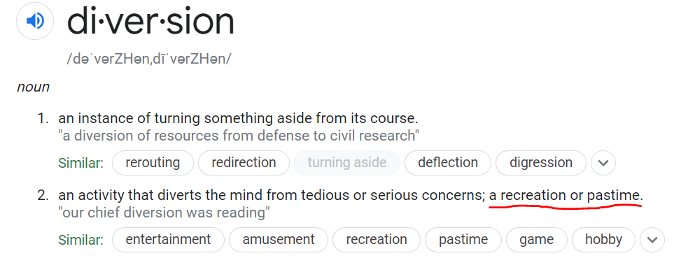

# GMAT

我们一句一句来 :\)

## 第一段

* In _Winters v. United States_ \(1908\), the Supreme Court held that **the right to use waters** flowing through or adjacent to the Fort Belknap Indian Reservation **was reserved** **to American Indians** by the treaty establishing the reservation. 

_Winters v. United States_ 这种形式一般是一个Supreme Court case， Supreme Court是美国最高法院，大概就是会针对大大小小的case做出一些裁决，这里就是一个叫Winters人对美国（也可以是人对人，州对人，人对学校等等）。这句话的主干就是：Supreme Court决定用水的权利是保留给印第安人的。什么水？只要是流过或者临近Fort Belknap Indian Reservation的水（Reservation是美国联邦政府指定给他们承认的印第安部落的居住和栖息区域）。这个决定的原因是什么？是建立这个reservation的条约。

* Although this treaty did not mention water rights, the Court ruled that the federal government, when it created the reservation, intended to deal fairly with American Indians by reserving for them the waters without which their lands would have been useless. 

进一步解释，虽然这个条约没有具体说到关于用水的权利，Supreme Court认为联邦政府在建立reservation的**本身意图就是公平地将用水的权利一并保留给他们**，不然他们的土地就会没有作用（没有水去灌溉，应该是这个意思）。注意哦，Supreme Court和联邦政府不是一波的哦，它是中立的。它一般会解释这种条约或者是法律中没有说清楚的灰色区域并做出裁决。

* Later decisions, citing Winters, established that courts can find federal rights to reserve water for particular purposes if \(1\) the land in question lies within an enclave under exclusive federal jurisdiction, \(2\) the land has been formally withdrawn from federal public lands—i.e., withdrawn from the stock of federal lands available for private use under federal land use laws—and set aside or reserved, and \(3\) the circumstances reveal the government intended to reserve water as well as land when establishing the reservation. 

这里的later decisions指的是_Winters v. United States_ 这个case之后的其他类似case的结果，citing Winters指的是利用Winters的结果来做出类似case的判决（这个在Supreme Court cases很常见，会有一个标志性的决定，然后之后的case会按照这个标准做出类似裁决）。这些later decision建立了这样一个标准，就是courts（法院，应该可以是Supreme Court最高法院也可以是地方的法院）可以认为联邦政府在以下情况或者目的下有权利将（用）水（权利）保留：

1. 涉及到的土地位置是在联邦政府管辖区内的一块飞地（enclave），意思就是这块地不一定属于联邦政府，但是它被联邦政府管辖的土地所包围。
2. 基本就是说这块地已经正式地被联邦政府保留了，不给任何私人使用。
3. 情况/上下文表明联邦政府在建立reservation的时候就有意图将水和土地（的权利）保留。


_Winters v. United States_ 对应这里的第3条 :\)


## 第二段

* Some American Indian tribes have also established water rights through the courts based on their traditional diversion and use of certain waters prior to the United States’ acquisition of sovereignty. For example, the Rio Grande pueblos already existed when the United States acquired sovereignty over New Mexico in 1848. 

一些印第安部落在美国（联邦政府）获得（这些印第安部落的土地和水的）主权之前，就通过法院建立起了他们用水的权利。这个权力是怎么获得的呢？因为他们本来就一直在用这些水。Traditional diversion我的理解就是印第安人自古传统就在有意无意的用水。有意无意来自于：Diversion可以理解为印第安人用水的传统**习惯**（见下图）。一个例子就是 Rio Grande pueblos （big river villages\)。

* Although they at that time became part of the United States, the pueblo lands never formally constituted a part of federal public lands; in any event, no treaty, statute, or executive order has ever designated or withdrawn the pueblos from public lands as American Indian reservations. 

虽然Rio Grande pueblos在当时成为了美国的一部分，但是他们从来没有正式成为联邦的公共土地，也就是说没有任何条约、法令、或是行政命令将pueblos从公共土地中划分成为美国印第安人的reservations。这里我觉得做题时肯定不会了解到这整个的过程是怎么样，但是从句中可以猜出一块地得成为联邦的公共土地，然后才能再被designate或者withdraw成印第安人的reservation。所以这里说的意思是，pueblos压根都不是reservations。


这里Rio Grande pueblos的有用水权利的决定，明显不来自于上面三条的第2、3条，而看起来来自于第1条。


* This fact, however, has not barred application of the Winters doctrine. What constitutes an American Indian reservation is a question of practice, not of legal definition, and the pueblos have always been treated as reservations by the United States. 

所以问题来了，为什么pueblos不是reservation，他们的人还有用水的权利呢？这是这里的however的来源，就是pueblos不是reservation这个fact和_Winters v. United States_这个case的情况不一样呀（因为Fort Belknap Indian Reservation是个reservation）。所以为什么这个Winters case的应用照样没问题呢？（not barred 没被阻碍）。哦~ 原来是：一个印第安reservation的建立，是实操性的问题（根据实际情况来的），而不是仅仅依靠于法律上的划分。这些pueblos（虽然法律上不是reservation）已经在实际情况下被美国当作reservation来看待了。

* This pragmatic approach is buttressed by _Arizona v. California \(1963\)_, wherein the Supreme Court indicated that the manner in which any type of federal reservation is created does not affect the application to it of the Winters doctrine. 

这种实操性的方法，在 Arizona v. California \(1963\) 这个case里再次被体现出来，这个case的decision支撑了之前的说法（是啥reservation或者法律条文上是不是都不影响Winters的应用）。

* Therefore, the reserved water rights of Pueblo Indians have priority over other citizens’ water rights as of 1848, the year in which pueblos must be considered to have become reservations.

所以，最终结论是Pueblo的印第安人对这里的水有优先使用权，因为他们在1848年 United States acquired sovereignty over New Mexico的时候，就已经被认为是reservations了。

