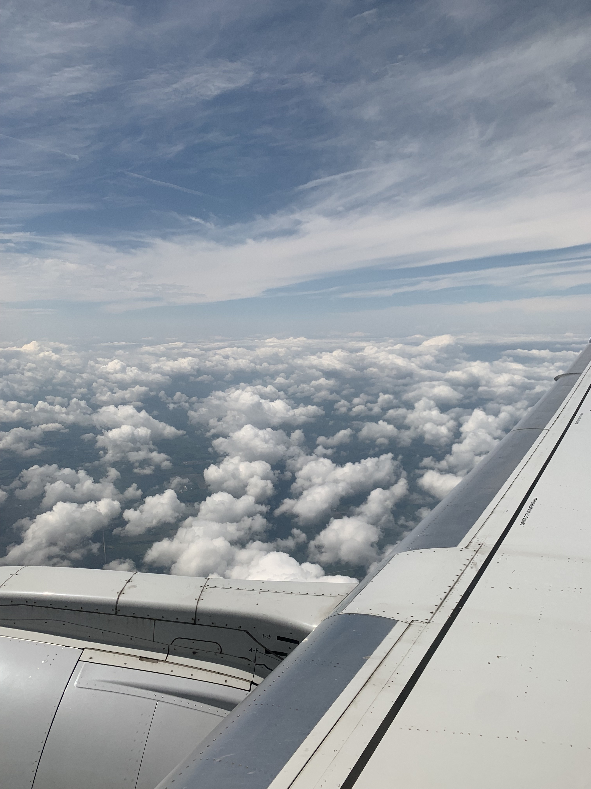
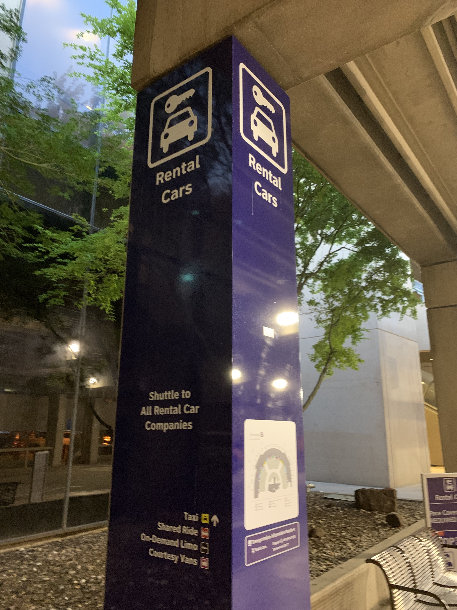
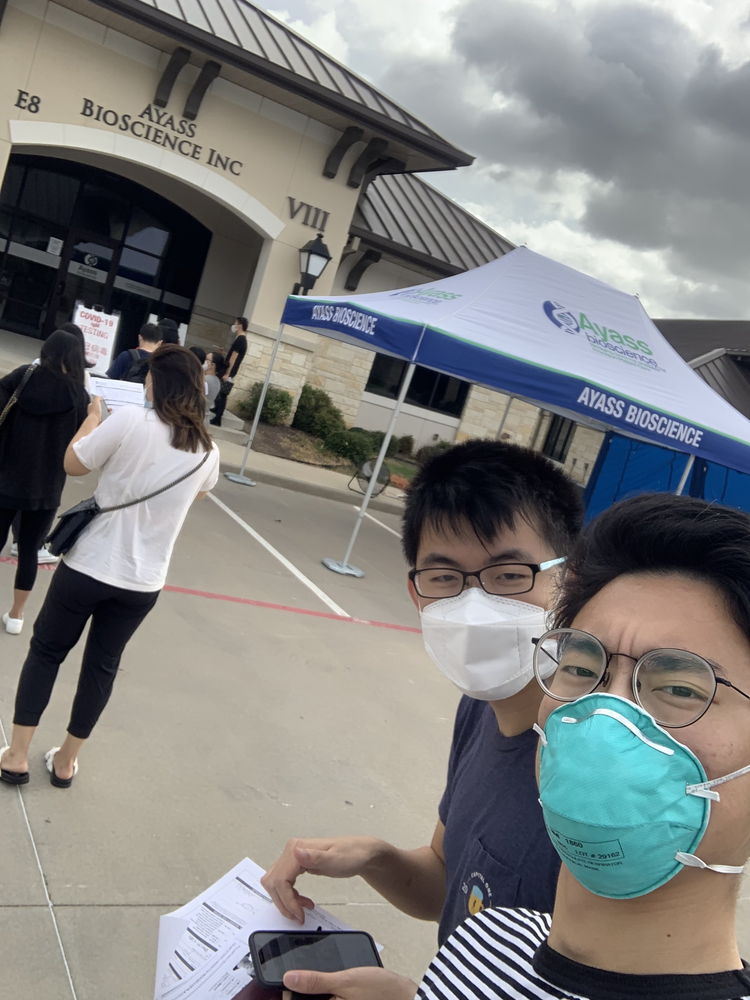
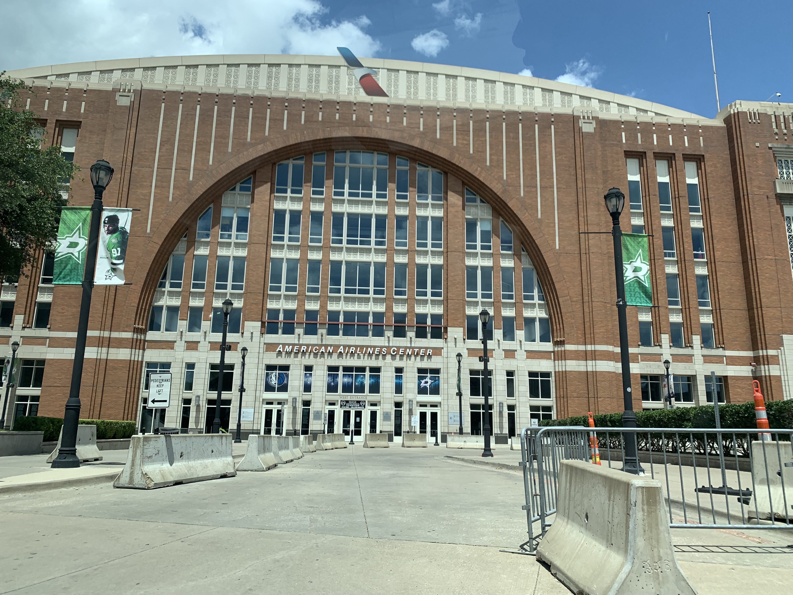

# Traveling to China During a Global Pandemic

## 前言

有趣的是，我上大学这两年以来还没有回过国。19年的寒假其实有机会，但是当时觉得刚打大学才几个月，然后美高基本也是一年才回去一次，然后那个寒假就没有决定回国。结果不久新冠就来了，经过了一段时间的混乱和恐慌之后，周围的人有陆陆续续回国，但是当时我觉得太麻烦，就一直拖着。直到21年5月份学校放暑假，因为学期末没有提前规划回国，所以五月初学校放假之后的想法是不回国。但是放假后休息了一周，突然感觉在美国生活有些无趣，也是因为太久没回国了有些想家，所以马上打算在六月底回国。

回国需要准备和操心的事情确实太多，这次决定回国还得感谢潘瑞和他一些朋友加上AA127群友的帮助，潘瑞写了一个很详细的[guide](https://ruipeterpan.gitbook.io/paper-reading-notes/blog/blog-index/aa127-hui-guo-ji)，有一些东西我和他是一样的我就偷懒复制粘贴了😊。还有就是AA127微信群里的一些资料，包括[AA127情况汇总](https://docs.google.com/document/d/1-m6GvE3ZDos4Mtm27KZhwPAYH0CTZme-Jh3zi_Cygwk/edit)、[达拉斯地区双测点酒店餐厅信息汇总等等](https://docs.qq.com/doc/DSHpwV0NDYkdZSVFT)。其他相关资料也还有一些，我就不全部放到这里了。

## 行前准备

* 4/5: 在UHS接种第一针Moderna疫苗。
* 5/7: 在UHS接种第二针Moderna疫苗。
* 5/14: 购买6/28 AA127 DFW-PVG 从达拉斯到上海的机票。这趟机票的话，F/J签证比较好拿绿码，其他的需要有“紧急必要“原因向大使馆申请。
* 5/15: 购买6/25 AA4231 MSN-DFW 从麦迪逊到达拉斯的机票，两趟虽然都是美国航空AA，但是并不是联程航班。
* 5/20: 预约RealTime实验室在6/25的PCR&IgM检测。
* 6/8: 经群友提醒Realtime存在IgM-N蛋白假阳的可能性，reschedule了DFW附近仅有的，经大使馆批准的另一家检测机构 \(Ayass\)

## 达拉斯

### 到达

于6月25日乘坐AA4231航班从麦迪逊前往达拉斯。美国国内航班除了需要戴口罩以外没有别的什么限制。因为新冠检测的时限是48小时，所以我们提前两天到达达拉斯。

我们住在DFW达拉斯机场C航站楼旁边的Hyatt酒店。到达当晚，我们熟悉了一下如何从酒店到航站楼和租车中心的路线。从酒店穿过一个停车场就能直达C航站楼，而租车中心的话是因为第二天去检测我们打算自己租车去drive thru。

### 检测

26日早上六点左右，我们就乘坐机场的摆渡车到租车中心去领之前预约的Dollar的车。之所以选Dollar是因为便宜和前台开的早，我们想早上早点去做检测。

我们到的时候差不多Dollar的前台刚开。虽然我们在队列的位置靠前，但是还是等到早上七点多才领到了车。从机场租车中心到Ayass检测点大概需要三十多分钟，我们八点左右到了检测点。

Ayass官方写的是8：45开门（第一次检测），大概是八点半左右就有工作人员来发需要填写的两张表格，一张是PCR的一张是IgM的，两张表填写内容相似。PCR的检测是免费的而IgM的检测需要现金450刀。填完表格工作人员会收走护照，然后继续开到上图的蓝色棚子下面做鼻拭子的PCR的核酸检测并拿回护照和工作人员打印的护照首页复印件。

做完PCR的检测，我们到Ayass的八号楼排队做IgM抽血检测。这里需要护照、刚刚填写的表格、和护照首页复印件。

由于打完疫苗后，IgM通常检测的S蛋白可能会呈阳性，所以一般打完疫苗的来检测的话，会跟医生讲加测N蛋白。N蛋白如果是阴性的话，就算S蛋白是阳性，IgM测试也被视作是阴性。要是没有打疫苗的话，只测S蛋白是350刀。如果加测N蛋白的话，一共是450刀而且工作人员只收现金。缴费之后会拿到一个收据，这个收据很重要需要拿好。之后就直接抽血了，这里需要特别注意的是一定要确认自己的姓名和出生日期，个人信息要是有误的话后面会很麻烦。

抽完血，需要在Ayass照三张照片。要求：手持护照首页（尽量能够看清护照上的字），Ayass的收款receipt，露出静脉抽血伤口，露脸。戴眼镜但是护照照片上没戴的同学们在拍照时建议把眼镜摘了。

1. 照片一：Ayass Bioscience Inc 八号楼楼下，COVID-19 IgM Testing牌子前
2. 照片二：IgM Sample Collection门前
3. 照片三：Ayass Bioscience大门前（这个有的人没拍，但是我们当时为了保险还是拍了）

照完照片，在Ayass要做的事情基本就结束了，当时大概是上午九点半左右，所以到的早还是做完的快。中午我们去了in and out吃了东西，下午就开着车在达拉斯周围转了转。打卡了达拉斯当地一些有名的stadium，感觉虽然没时间去看比赛，但是能去看看这些stadium也就挺满足的了。

