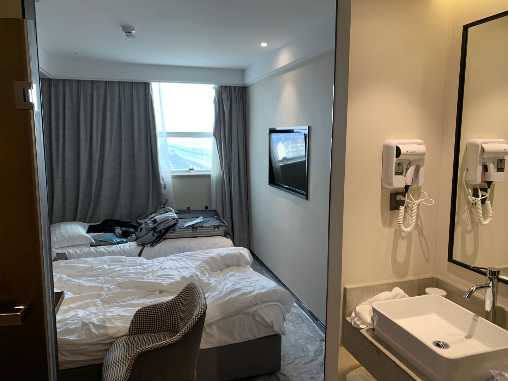

# Traveling to China During a Global Pandemic

## 前言

有趣的是，我上大学这两年以来还没有回过国。19年的寒假其实有机会，但是当时觉得刚打大学才几个月，然后美高基本也是一年才回去一次，然后那个寒假就没有决定回国。结果不久新冠就来了，经过了一段时间的混乱和恐慌之后，周围的人有陆陆续续回国，但是当时我觉得太麻烦，就一直拖着。直到21年5月份学校放暑假，因为学期末没有提前规划回国，所以五月初学校放假之后的想法是不回国。但是放假后休息了一周，突然感觉在美国生活有些无趣，也是因为太久没回国了有些想家，所以马上打算在六月底回国。

回国需要准备和操心的事情确实太多，这次决定回国还得感谢潘瑞和他一些朋友加上AA127群友的帮助，潘瑞写了一个很详细的[guide](https://ruipeterpan.gitbook.io/paper-reading-notes/blog/blog-index/aa127-hui-guo-ji)，有一些东西我和他是一样的我就偷懒复制粘贴了😊。还有就是AA127微信群里的一些资料，包括[AA127情况汇总](https://docs.google.com/document/d/1-m6GvE3ZDos4Mtm27KZhwPAYH0CTZme-Jh3zi_Cygwk/edit)、[达拉斯地区双测点酒店餐厅信息汇总等等](https://docs.qq.com/doc/DSHpwV0NDYkdZSVFT)。其他相关资料也还有一些，我就不全部放到这里了。

## 行前准备

* 4/5: 在UHS接种第一针Moderna疫苗。
* 5/7: 在UHS接种第二针Moderna疫苗。
* 5/14: 购买6/28 AA127 DFW-PVG 从达拉斯到上海的机票。这趟机票的话，F/J签证比较好拿绿码，其他的需要有“紧急必要“原因向大使馆申请。
* 5/15: 购买6/25 AA4231 MSN-DFW 从麦迪逊到达拉斯的机票，两趟虽然都是美国航空AA，但是并不是联程航班。
* 5/20: 预约RealTime实验室在6/25的PCR&IgM检测。
* 6/8: 经群友提醒Realtime存在IgM-N蛋白假阳的可能性，reschedule了DFW附近仅有的，经大使馆批准的另一家检测机构 \(Ayass\)

## 达拉斯

### 到达

于6月25日乘坐AA4231航班从麦迪逊前往达拉斯。美国国内航班除了需要戴口罩以外没有别的什么限制。因为新冠检测的时限是48小时，所以我们提前两天到达达拉斯。

我们住在DFW达拉斯机场C航站楼旁边的Hyatt酒店。到达当晚，我们熟悉了一下如何从酒店到航站楼和租车中心的路线。从酒店穿过一个停车场就能直达C航站楼，而租车中心的话是因为第二天去检测我们打算自己租车去drive thru。

### 检测

26日早上六点左右，我们就乘坐机场的摆渡车到租车中心去领之前预约的Dollar的车。之所以选Dollar是因为便宜和前台开的早，我们想早上早点去做检测。

我们到的时候差不多Dollar的前台刚开。虽然我们在队列的位置靠前，但是还是等到早上七点多才领到了车。从机场租车中心到Ayass检测点大概需要三十多分钟，我们八点左右到了检测点。

Ayass官方写的是8：45开门（第一次检测），大概是八点半左右就有工作人员来发需要填写的两张表格，一张是PCR的一张是IgM的，两张表填写内容相似。PCR的检测是免费的而IgM的检测需要现金450刀。填完表格工作人员会收走护照，然后继续开到上图的蓝色棚子下面做鼻拭子的PCR的核酸检测并拿回护照和工作人员打印的护照首页复印件。

做完PCR的检测，我们到Ayass的八号楼排队做IgM抽血检测。这里需要护照、刚刚填写的表格、和护照首页复印件。

由于打完疫苗后，IgM通常检测的S蛋白可能会呈阳性，所以一般打完疫苗的来检测的话，会跟医生讲加测N蛋白。N蛋白如果是阴性的话，就算S蛋白是阳性，IgM测试也被视作是阴性。要是没有打疫苗的话，只测S蛋白是350刀。如果加测N蛋白的话，一共是450刀而且工作人员只收现金。缴费之后会拿到一个收据，这个收据很重要需要拿好。之后就直接抽血了，这里需要特别注意的是一定要确认自己的姓名和出生日期，个人信息要是有误的话后面会很麻烦。

抽完血，需要在Ayass照三张照片。要求：手持护照首页（尽量能够看清护照上的字），Ayass的收款receipt，露出静脉抽血伤口，露脸。戴眼镜但是护照照片上没戴的同学们在拍照时建议把眼镜摘了。

1. 照片一：Ayass Bioscience Inc 八号楼楼下，COVID-19 IgM Testing牌子前
2. 照片二：IgM Sample Collection门前
3. 照片三：Ayass Bioscience大门前（这个有的人没拍，但是我们当时为了保险还是拍了）

照完照片，在Ayass要做的事情基本就结束了，当时大概是上午九点半左右，所以到的早还是做完的快。中午我们去了in and out吃了东西，下午就开着车在达拉斯周围转了转。打卡了达拉斯当地一些有名的stadium，感觉虽然没时间去看比赛，但是能去看看这些stadium也就挺满足的了。

当天下午四点多左右，我们收到了PCR核酸检测阴性的结果，Ayass的工作人员通过email发过来一个加密的PDF。晚上十一点多的时候，我们收到了IgM的检测结果。我虽然打了疫苗，但是结果是IgM-S Non-Reactive/Negative, IgM-N Non-Reactive/Negative，也就是S和N蛋白都是阴性。而和我同性的朋友是S蛋白阳但是N蛋白阴，但是不管怎样，只要N蛋白是阴性，IgM检测就是阴性。

紧接着，我们花了大概半个多小时在微信小程序上（防疫健康码国际版）提交了已经准备好的资料，所有资料需要以图片的形式上传：

1. 护照首页 + 签证页 。
2. 疫苗接种声明书 + CDC小白卡 + 疫苗接种机构证明。
   1. 疫苗接种声明书可以从大使馆官网下载，链接[在这](http://www.china-embassy.org/eng/notices/P020210421787870030822.pdf)。注意网上有好几个版本的接种声明表，现在应该是只认这个有英文的表格
   2. 疫苗接种机构证明：Walgreens应该有自己的documentation。我是在学校的UHS进行的接种，所以在Wisconsin Immunization Registry request了record。全美50州获取疫苗接种记录的方法可以看[这里](https://www.cdc.gov/vaccines/programs/iis/contacts-locate-records.html
      )
3. I20
4. 回国航班的Itinerary。如在AA官网，confirmation email里都可以找到
5. Ayass预约邮件。在[Ayass官网预约](https://ayassbioscience.com/covid-19-testing-for-travelers-to-china/)之后，confirmation email里可以找到，保存成PDF
6. PCR检测报告
7. IgM检测报告。如果同时测了IgM-S和IgM-N，可以把Ayass发来的两张PDF转成图片。
8. 在Ayass拍的三张照片（见上）

* 我们准备了但是没有提交的其他材料
  * 做PCR时捅鼻子的照片。注意Ayass要求拍摄时不能拍到工作人员
  * 回国必要性证明（F签坐AA127应该不用写，其他身份/始发地可以看[这里](https://docs.qq.com/doc/DSE9Ga2dudG9jZkZu)做个参考）
* 健康码的小程序每次审核只能上传十张照片，超过十张可能会在提交申请的时候被吞图。有时图片尺寸过大可能还会上传失败，这种情况的话把图片删了重新上传多试几次即可。注意上传的图片会被压缩，提交之前最好检查一下护照/I20上的字样是否清晰。并且在提交前需要检查是否有被吞图，不然的话回到上一步删去被吞掉的图片，再次尝试上传。
* 健康码的有效期是48小时，不过还是建议一拿到检测报告就提交申请以防出问题
* 最好在去机场前申请海关码，也是微信小程序上，叫“海关旅客指尖服务“。申请海关码不需要人工审核，能够马上拿到一个二维码，并不是动态的所以最好截图保存以免落地中国的时候没网这类的问题。这个二维码是在中国海关入关的时候用，有效期是24小时，所以建议在值机前几小时填写。
* 健康码在check in的时候柜台工作人员会查，在登机之前会检查两个码，要去检票口敲个章才能登机。

凌晨两点多的时候我们拿到了绿码，当时我已经睡着了。不过感谢潘瑞一直没睡等着绿码，然后叫醒告知我。当天晚上没怎么睡，因为想在飞机上更好睡一些。第二天清晨五点左右，我们就走到机场的C航站楼check in，工作人员粗略的看了一眼绿码和检测报告，我们就坐着Skylink到了D航站楼等待登机。

AA127航班的飞机上上座率并不高（见图），我和潘瑞之间就没有人。

经过十几个小时的漫长旅途，我们终于到达了上海。最难受的还是口罩戴的太久了，感觉耳朵都要掉了。但是想到之前回国的同胞们穿防护服什么的，我们这根本算不了什么。

落地上海之后，一切就可以跟着队伍走流程了。有很多很辛苦的、穿着防护服的工作人员在帮忙引流和服务。感觉过了好几道关卡，需要准备的资料有护照、登机牌、和海关码，我记得还测了两次体温，做了鼻咽拭子的核酸检测。各种的排队等候，我已经是精疲力竭了。但是想到周围忙忙碌碌的工作人员，他们肯定更加辛苦。因为最终目的地是湖北，我走的是外省的通道，等了几十分钟之后，我们上了到隔离酒店的大巴。大巴车上我确实太累了，睡着了好几次，坐了一个多小时之后到了闵行区的一个隔离酒店。

相比于潘瑞和群里大部分伙伴，我这个隔离酒店不算特别好的，但好在不算贵（¥4450包括餐食）。刚来的时候空调用不了，我以为是根据防疫的要求不使用，然后就被热了一整天（其实也打了前台电话，但是没人接）。第二天开门拿餐的时候问了隔壁的，他说空调蛮冷，我直接诧异。昨天又跟前台打了电话，之后通过多次交流，空调最终好了，但是噪音很大。今天说会有人来看看，这个噪音偏偏睡觉的时候感觉没那么响，早上起来却有些忍受不了。

所以现在，我就耐心等待了十几天之后，回到湖北然后再居家隔离14天。回国的路途困难重重，但我丝毫不后悔。两年没回家，能够见到家人亲戚和朋友便是最好的馈赠。我相信这两年，我自己的变化有很多，我想家里某些地方可能也有些不同。我很高兴弟弟长大了两岁，但也有亲戚去世了我没能见上最后一面。其实，最想回国的时候，就是在国外忙碌到感觉努力没有了方向和动力，而每日重复的生活愈感孤独，对周遭的环境也有些厌倦。但是一想到如果能够回国，见到家人和朋友，调整心情、心态、和方向，我相信无论怎样都会倍增动力。所以我才这么费劲的想回国，更想在这里感谢给予我支持和帮助的家人和朋友，让我能够成功回到国内。一段短暂的旅途告一段落，又将是一段新的旅途。无论怎样，我对回国的这一两个月，对将要线下的秋季学期，都是充满期待的！

